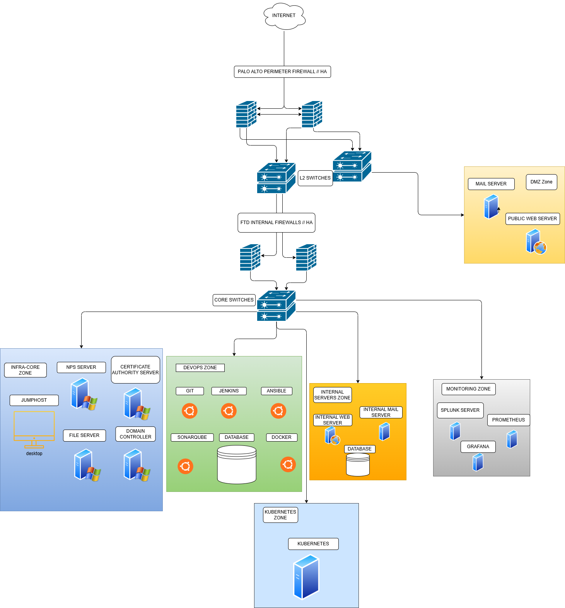
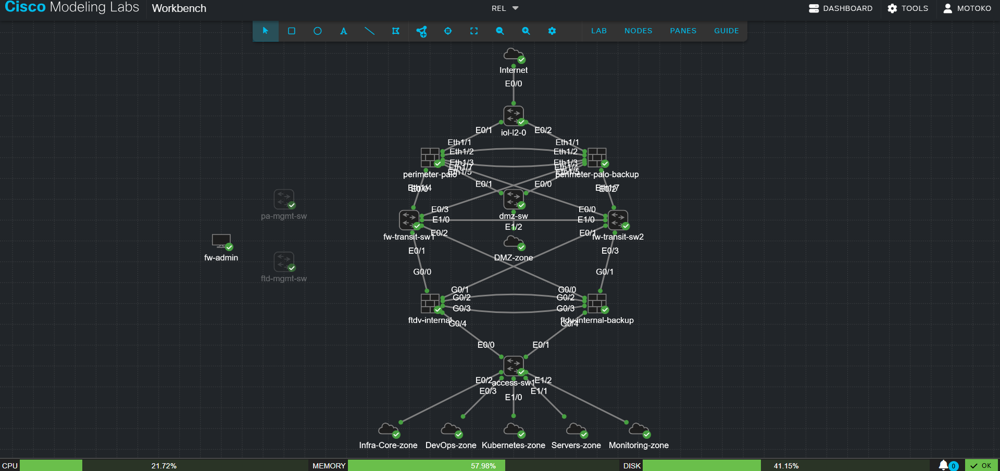
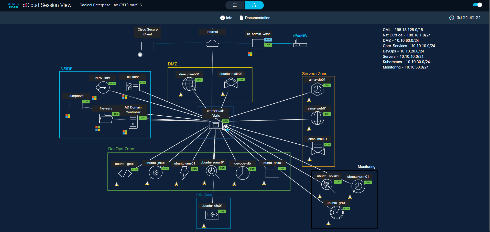

# Network Diagrams

This lab topology is built across two platforms working together: 
Cisco Modeling Labs (CML) and Cisco dCloud.

---

## Full Topology Overview

Complete end-to-end view of the network — perimeter firewall, internal 
firewall, DMZ, internal zones, and transit links.

---

## CML View

Shows how the topology is modeled and visualized within CML itself — 
the virtual device canvas and node connections as configured in the lab.

---

## dCloud View

Shows the servers hosted within dCloud across the various 
zones (DMZ, internal servers, etc.), along with the session environment 
that ties everything together with CML.

---

### How they fit together

CML models and runs the network devices — firewalls, HA pairs, and 
routing/transit links — while dCloud hosts the actual servers
that live inside each zone, plus the session infrastructure 
connecting the two platforms. Together they form the complete topology 
shown above: CML providing the network fabric, dCloud providing the 
compute layer.
