# 02 - FTD Network Config

This lab covers interfaces, security zones, DNS for data interfaces, and OSPF routing on the FTD.

## Interfaces and Zones

I started my FTD with only 3 usable interfaces and I needed 8:

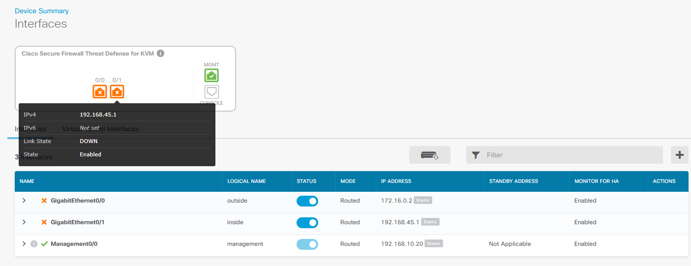

This was meant to be set initially in CML:

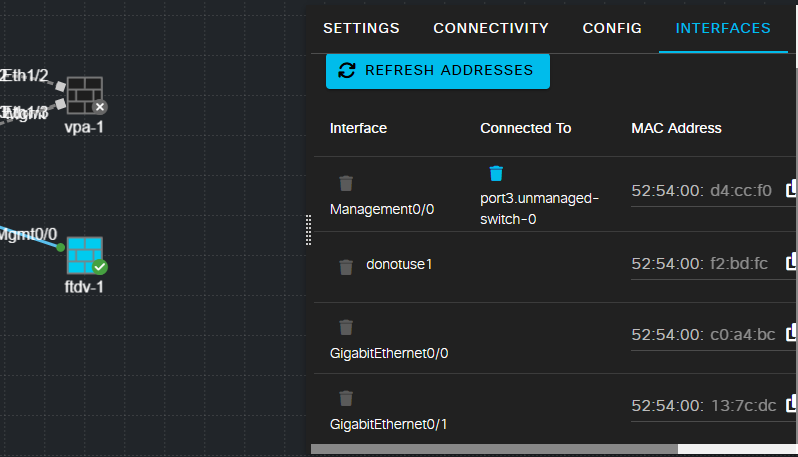

> **Note:** Always add enough interfaces to the device up front, because adding new interfaces later requires wiping and rebuilding it. If you're in that situation and don't want to lose your config so far, do a manual backup and restore.

Go to **Device > Interfaces**.

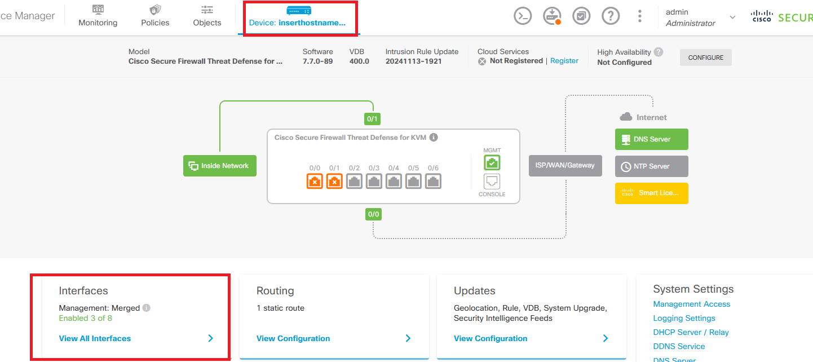

The management and outside interfaces were already set during initial setup. You'll notice g0/1 also has an IP — this usually gets set by default via a DHCP server on the interface. Click the edit (pencil) icon to work with it.

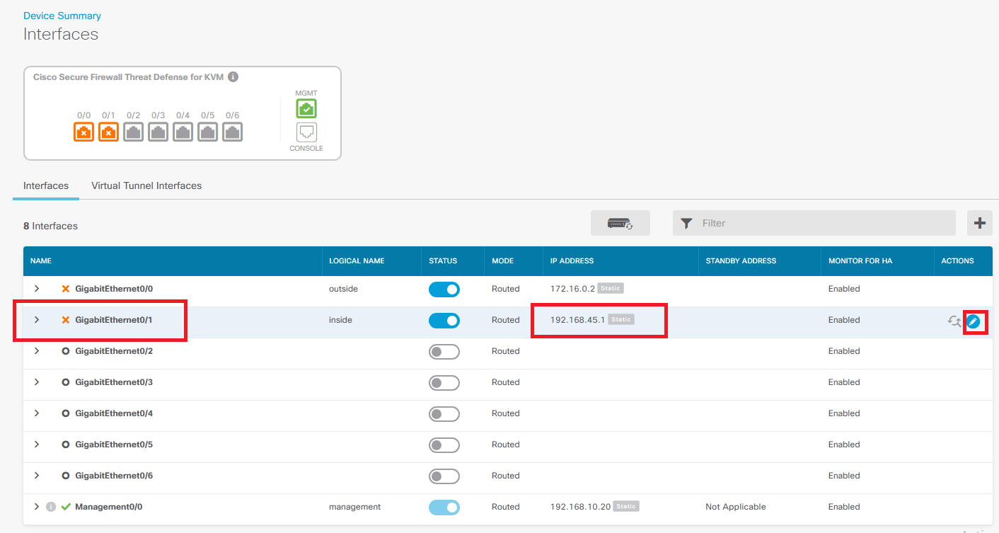

You can delete the DHCP server directly from here, or go to **Device > System Settings > DHCP Server / Relay**.

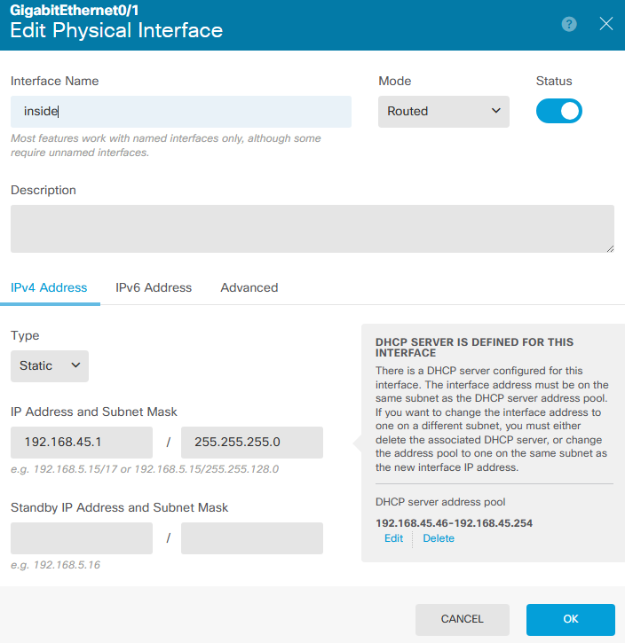

I set the interface name to describe that it's the second link going north.

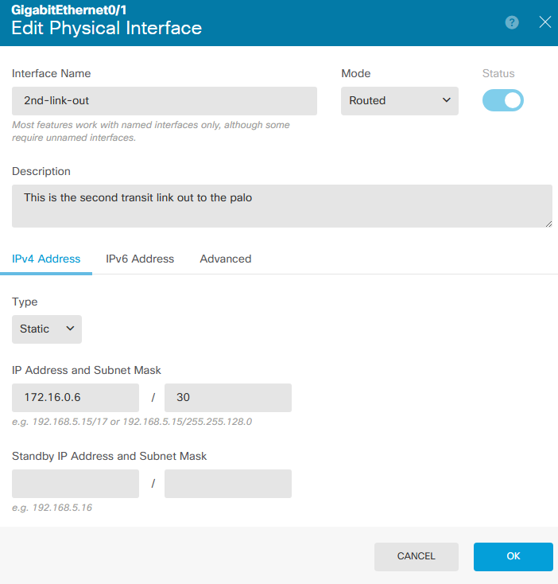

### Subinterfaces (Trunk)

Based on my topology, I have a link going south that needs to be set as a trunk for my internal zones.

Click the plus sign to add a subinterface. Make sure you select the correct parent interface. For the subinterface ID, I usually match it to the VLAN ID — not required, but good practice for simplicity. Set the IP and mask.

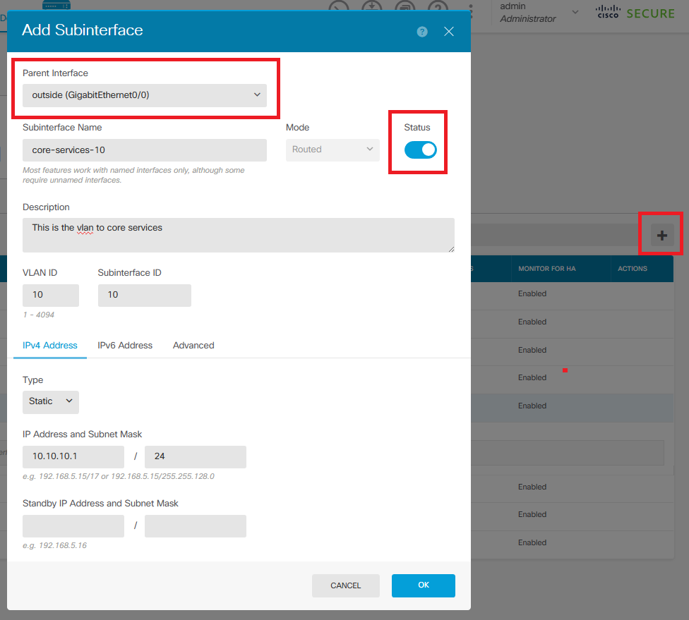

Final look at how all subinterfaces were set:

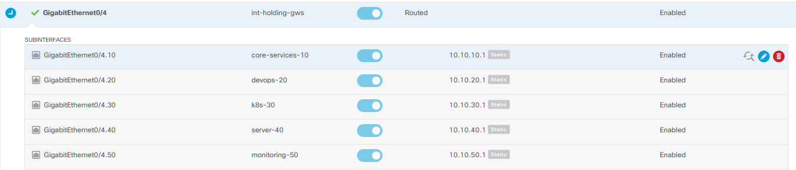

### Security Zones

Go to **Objects > Security Zones**.

I used the two default zones, since this topology only requires two: **outside** and **inside**.

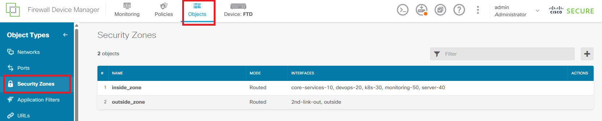

Add the interfaces to the zones. Note that on the inside zone I did **not** add the physical interface — I added the subinterfaces, since those are what get used in the policies.

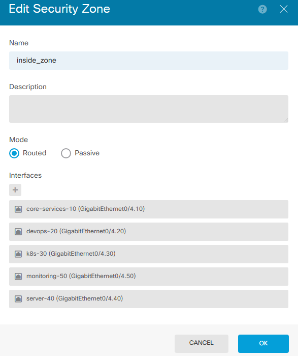

## DNS for Data Interfaces

Check **Objects > DNS Groups**. Here you can see the Umbrella DNS servers, along with the custom group — which is what was set on the CLI earlier on the lab 01 ftd.

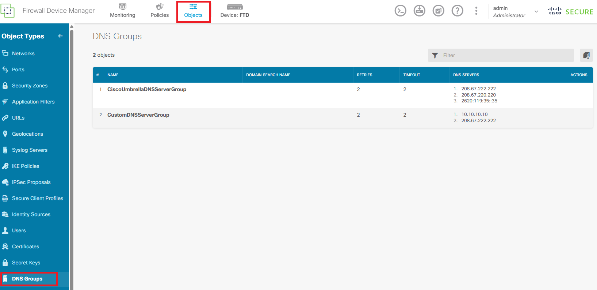

Go to **Device > System Settings > DNS Server**. The mgmt interface is already using the custom group (which includes our DC), but the data interfaces are not. We need the data interfaces to query our DC so FQDN-based policies work correctly — so change this to the custom DNS group as well.

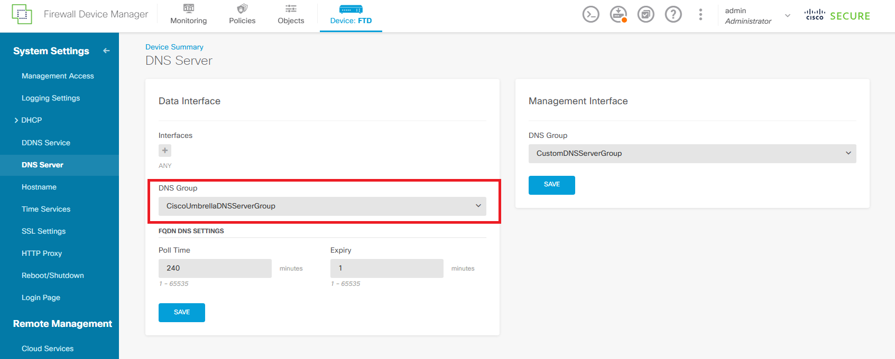

## OSPF Routing

Go to **Device > Routing > OSPF**.

This topology only needs a single router, so we're using the default. (On a future lab unrelated to REL, multiple router instances might come into play, but not here.)

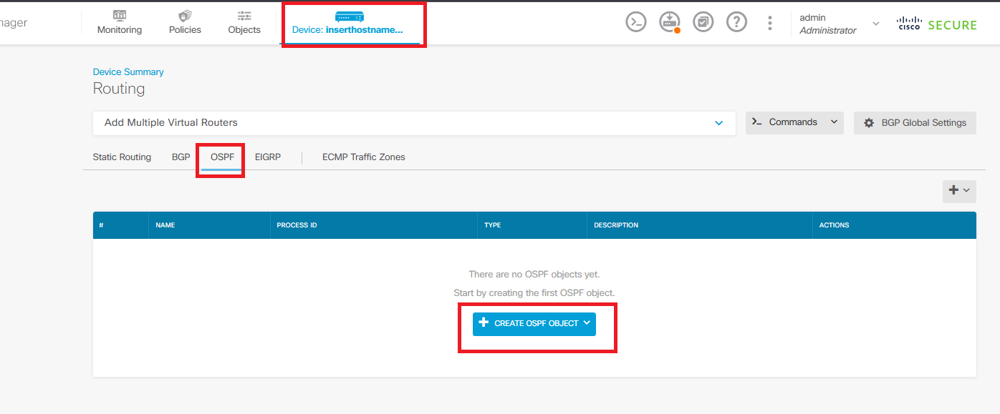

Click **Create OSPF Object**. You can name it and add a description — use **Show Disabled** to reveal the hidden settings.

Set the router OSPF process ID. **Log Adjacency Changes** is enabled, since I want that info.

Under advanced setup you'll find router-id, area (with configure area underneath it), network, and neighbor — all of these are hidden by default and need to be enabled. Use the **+** to add entries and **-** to remove them.

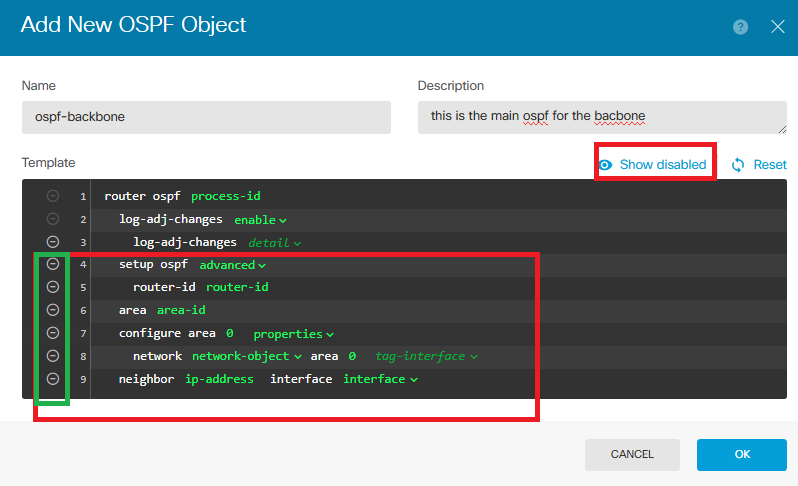

Final OSPF object setup:

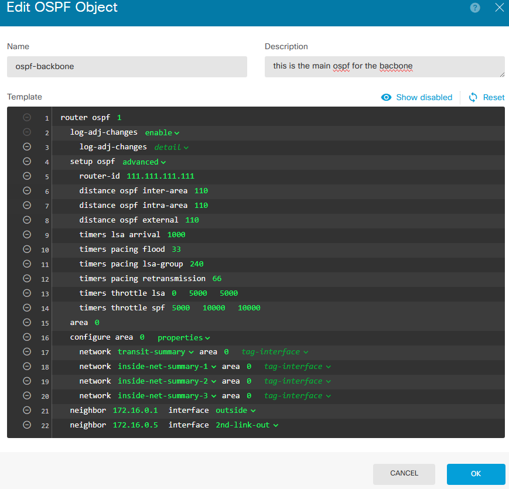

If you need to duplicate any command, click the three dots and choose duplicate.

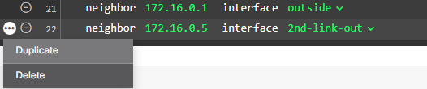

### Network Summaries

You'll notice a few OSPF **network** commands used for summaries. These reference summary network objects created under **Objects > Networks** using the **+** sign, instead of listing each individual network manually.

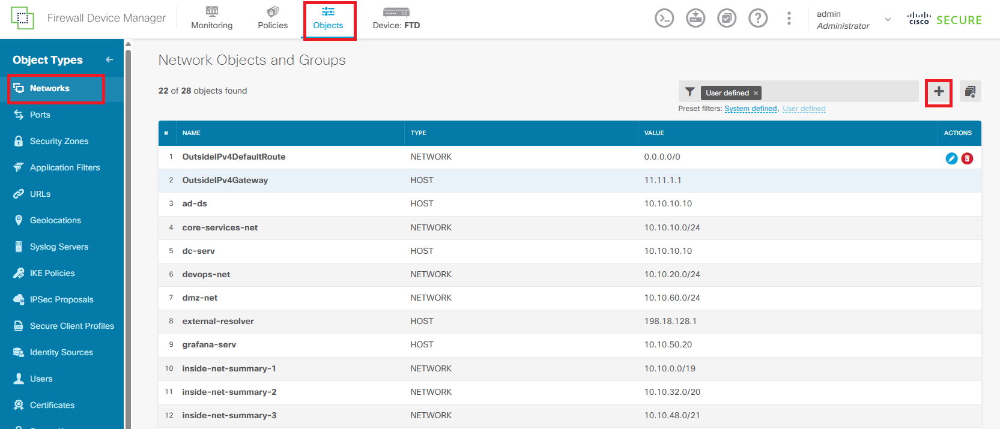
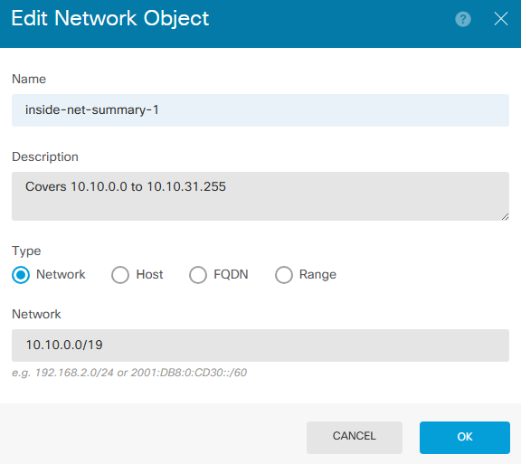

### Enabling OSPF on Interfaces

Back in the OSPF routing config, I selected the interfaces that should run OSPF. Note that the Palo Alto side uses custom metrics, since there are 2 transit networks connecting the FTD to the Palo Alto.

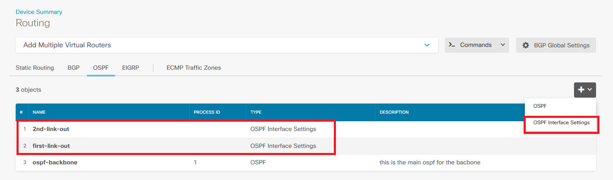

- **Link 1:** cost set to 10, network type changed from default (broadcast) to **p2p non-broadcast**.

  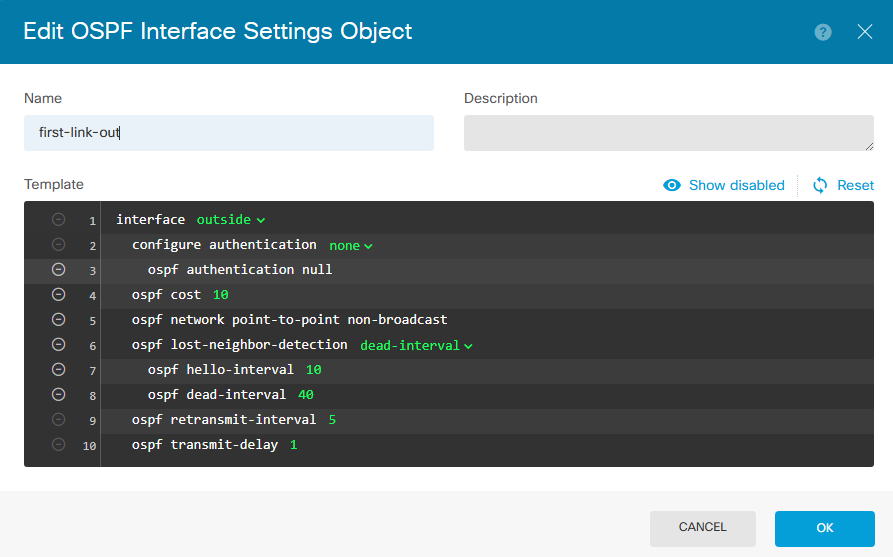

- **Link 2:** cost set to 50, also **p2p non-broadcast**.

  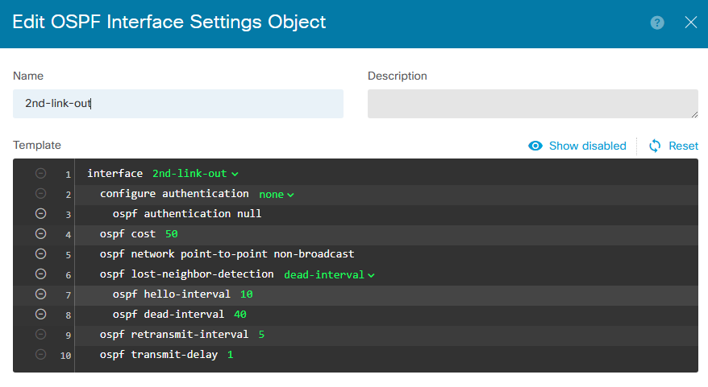

The neighbor statement lives on the OSPF object itself. The per-interface settings are only enabled when you want to override something from the main OSPF object — like we did here for metric and network type.
