# Palo Alto Network Configuration — Interfaces, Zones, Routing & NAT

## Lab Overview

This lab builds on the [Initial Palo Alto Config](palo-alto-initial-config/) lab and configures the core Layer 3 networking on the firewall: interfaces, zones, address objects, a virtual router, OSPF, and NAT for internet access.

The objects and IP scheme used here (transit subnets, DMZ subnet, etc.) map directly to the broader REL topology — see the [related docs](../../docs/) for the full picture. This lab can be followed as a standalone exercise with your own addressing scheme; the specific object names and IPs below exist to fit the larger REL topology, not because they're the only valid values.

---

## 1. Interfaces & Zones

Now that the [initial config lab](palo-alto-initial-config/) is done, you can rename the interfaces if you'd like — I personally leave them as their physical interface names (e.g. `ethernet1/1`).

Go to **Network > Interfaces**, select the interface, and name it appropriately.

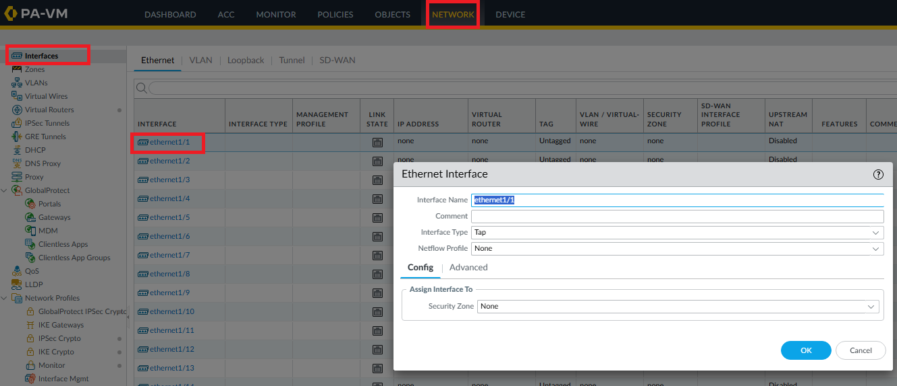

Change the interface type based on your use case. For example, `e1/1` needs to be a **Layer 3** interface here. You can also set the virtual router (I selected `default`, even though it hasn't been configured yet). If you've already created a zone, select it — or create one directly from this screen.

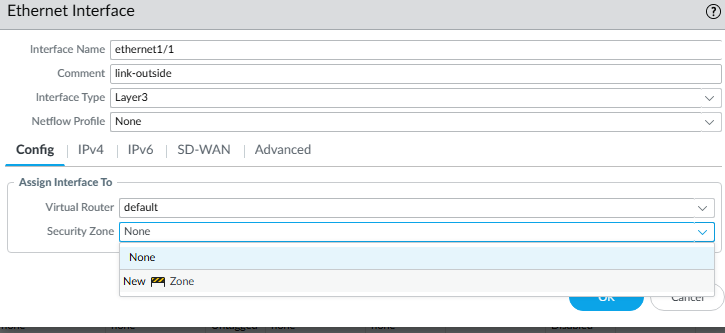

> Creating an object from within a different configuration window works the same as creating it from its dedicated menu. Palo Alto lets you create almost anything on the fly as you go — just stay consistent with your naming conventions so objects follow a clear pattern and are easy to recognize at a glance.

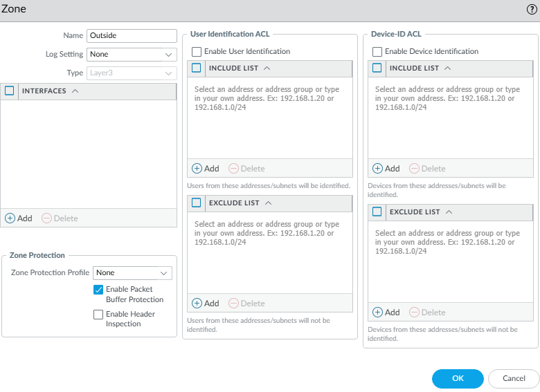

I created a zone named `Outside`. Note that it won't let you assign the interface itself at this point, since you're in the middle of configuring `e1/1` as Layer 3.

For now, click **OK** so you can see how this looks when the required objects are created manually ahead of time. Next we'll need an address object.

> **Note:** you need to know where each type of object lives. For example, if you'd created the zone beforehand instead of inline, you'd have gone to **Network > Zones** to add it there.

For the address object, go to **Objects > Addresses**, name it, and set the IP. I like including the IP in the name so I can identify the object by name and IP at a glance.

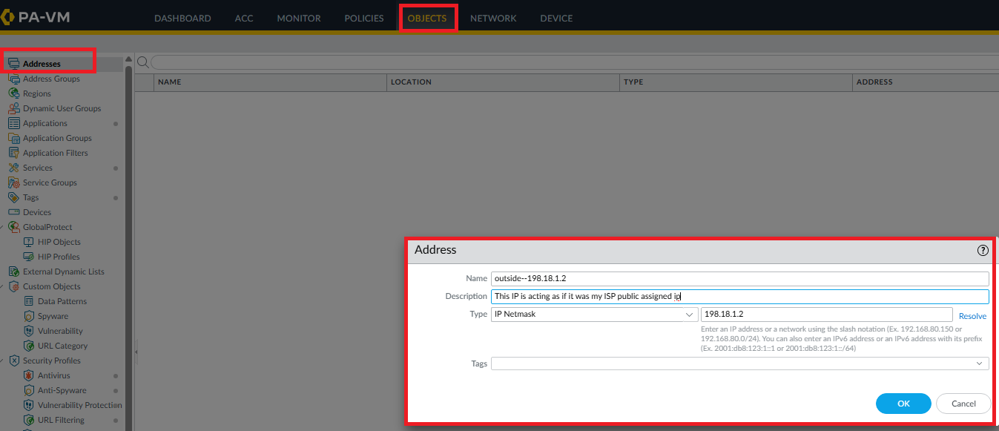

Back on the interface, go to **Network > Interfaces > ethernet1/1 > IPv4**, click **Add**, and the object you just created will be available to select.

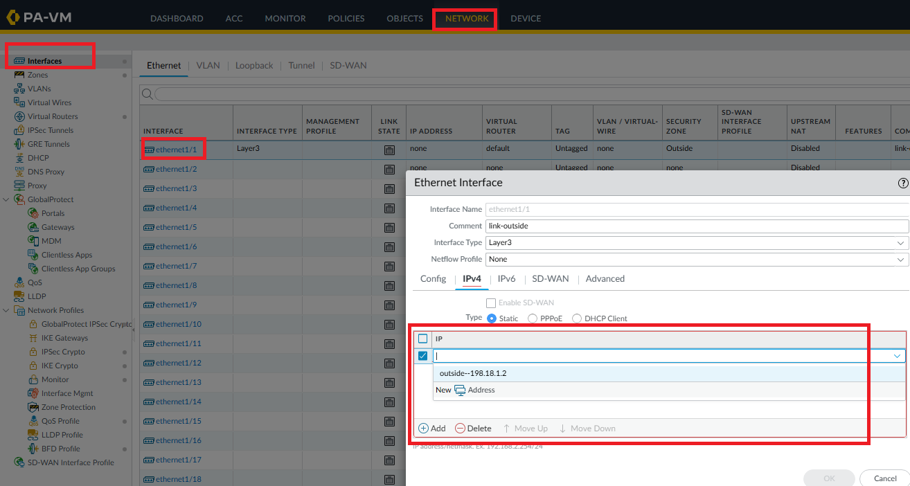

### Reference: objects used in this lab

If you'd rather create everything up front, here's the full list. I built these incrementally through the lab instead, to explain the reasoning at each step — some items are skipped over below if already covered above.

**Zones** (`Network > Zones`)

| Zone | Notes |
|---|---|
| `dmz-zone` | |
| `Inside` | |
| `Outside` | created in the interface setup step above |

> Naming note: `Inside` and `Outside` are capitalized/unhyphenated on purpose — the FTD downstream treats those two zones specifically differently, so keeping them visually distinct from `dmz-zone` (which isn't treated any differently) is intentional, not an inconsistency.

**Interface Management Profile** (`Network > Network Profiles > Interface Mgmt`)

| Name | Setting |
|---|---|
| `ping-permitted` | ICMP checked |

**Address Objects** (`Objects > Addresses`)

| Name | Type | Address |
|---|---|---|
| `match-all-add.0.0.0.0` | IP Netmask | `0.0.0.0/0` |
| `1st-transit-ip-in-172.16.0.1` | IP Netmask | `172.16.0.1/30` |
| `2nd-transit-ip-in-172.16.0.5` | IP Netmask | `172.16.0.5/30` |
| `dmz-default-10.10.60.1` | IP Netmask | `10.10.60.1/24` |
| `Outside-198.18.1.2` | IP Netmask | `198.18.1.2` (created in the step above) |

**Interface Assignments** (`Network > Interfaces > Ethernet`)

| Interface | Type | IP Address / Object | Virtual Router | Zone |
|---|---|---|---|---|
| `e1/1` | Layer 3 | `Outside-198.18.1.2` | `default` | `Outside` |
| `e1/2` | HA | — | — | — |
| `e1/3` | HA | — | — | — |
| `e1/4` | Layer 3 | `1st-transit-ip-in-172.16.0.1` | `default` | `Inside` |
| `e1/5` | Layer 3 | `dmz-default-10.10.60.1` | `default` | `dmz-zone` |
| `e1/7` | Layer 3 | `2nd-transit-ip-in-172.16.0.5` | `default` | `Inside` |

## 2. Interface Management Profile (Allow Ping)

Next, go to the **Advanced** tab on the interface > **Management Profile**, and create a new one.

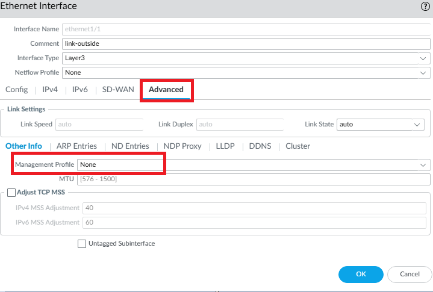

This profile allows ping for troubleshooting. I left it wide open — allowing from any host — because I want end-to-end connectivity testing from anywhere at any time in this lab. In production, scope this down to a specific allowed range to avoid ICMP floods, reconnaissance, or other abuse.

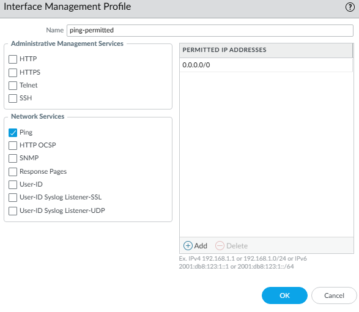

## 3. Virtual Router

Go to **Network > Virtual Routers**, select `default`, and rename it to `palo-vrouter`.

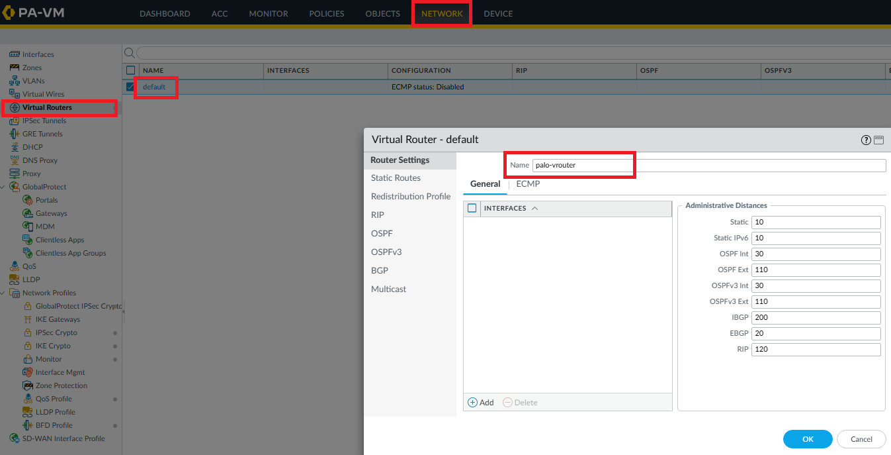

## 4. Default Static Route

Go to **Static Routes > Add**, name the route, and for the destination, set an address object (create one inline if you haven't already). I used the match-all address object here, since this is our default route out. Set the interface to `e1/1`. Next hop was left as `None`, though it could be set manually.

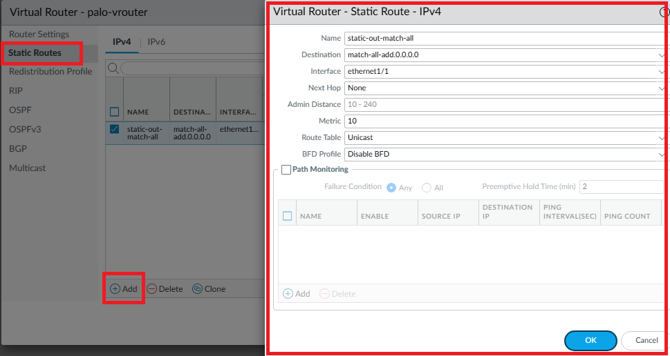

> **Why `None` works here:** there's a switch between the HA firewall pair and the external connector, but it's a plain L2 segment with no VLANs — the switch exists only because two interfaces (active + standby firewall) can't both plug directly into a single port on the external connector. Functionally, that segment only ever has two active endpoints talking to each other (the active firewall and the external connector), so it behaves like a point-to-point link even though it's technically Ethernet. With next hop set to `None`, the firewall ARPs for the actual destination IP of each packet on that segment — this works because the external connector answers ARP for any destination (acting as the gateway/internet simulator for the lab). On a real ISP hand-off without that proxy-ARP-like behavior, you'd normally want an explicit gateway IP instead.

## 5. OSPF

This lab uses OSPF. Go to **OSPF**, set it to enabled, and enable **Reject Default Route** — since a static default route is already set, and this is the perimeter firewall, we don't want another device injecting a default route into the OSPF process. Once done, click **Add**.

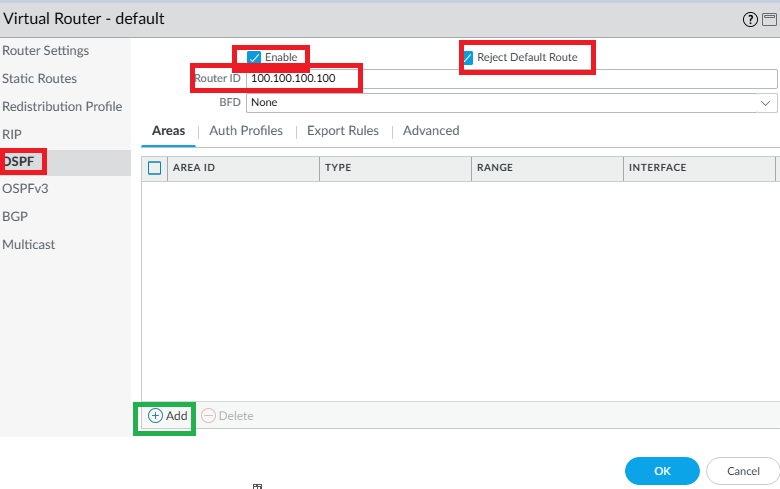

Set the Area ID. We only have one area in this lab, so we use `0.0.0.0` (Area 0) — Palo Alto represents area IDs in dotted-decimal notation rather than a plain integer. Leave **Type** as `Normal`. Under **Range**, add the subnet you want to advertise. For the REL perimeter firewall, the only subnet advertised is the DMZ — refer to the topology diagram if needed.

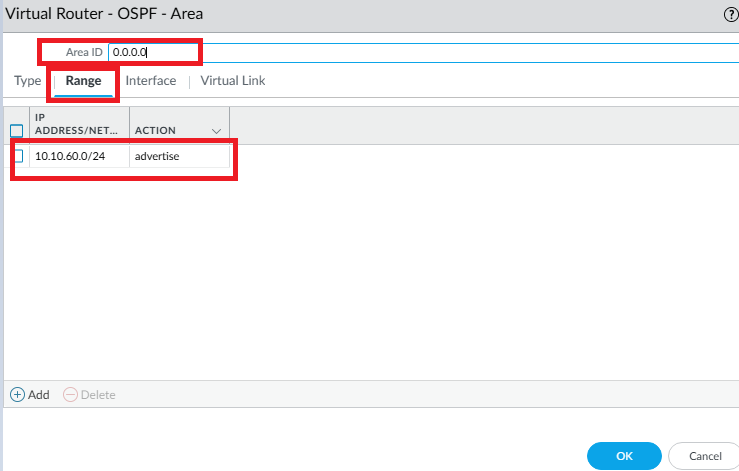

In the **Interface** section, add `e1/5` (the DMZ interface) and `e1/4` / `e1/7` (the inside transit interfaces pointing to the FTD).

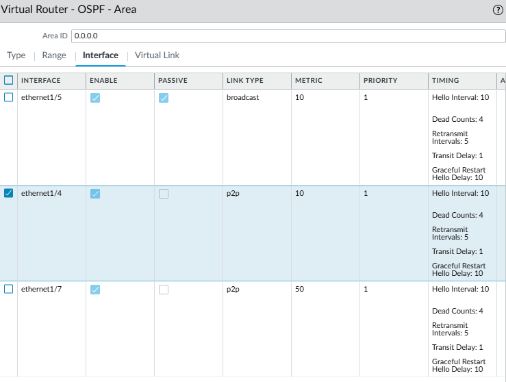

| Interface | Enable | Passive | Link Type | Metric |
|---|---|---|---|---|
| `ethernet1/5` | ✓ | ✓ | Broadcast | 10 |
| `ethernet1/4` | ✓ | | P2P | 10 |
| `ethernet1/7` | ✓ | | P2P | 50 (intentionally higher — see below) |

> `e1/7`'s metric is manually set higher than `e1/4`'s. Full explanation in the [network architecture doc](https://github.com/RadicalSamu/radical-enterprise/blob/main/docs/network-architecture.md#perimeter-to-internal-link-palo-alto--ftd).
>
> **TL;DR:** this lets OSPF converge onto the secondary link if the primary fails, which is faster than triggering a full HA failover to the standby Palo Alto (covered in the HA lab).

### Redistribute the default route

We want to redistribute the default route to devices further downstream so they know how to reach the internet.

Go to **Redistribution Profile > Add**, name the profile, set the action to **Redistribute**, and set the source type to **Static**.

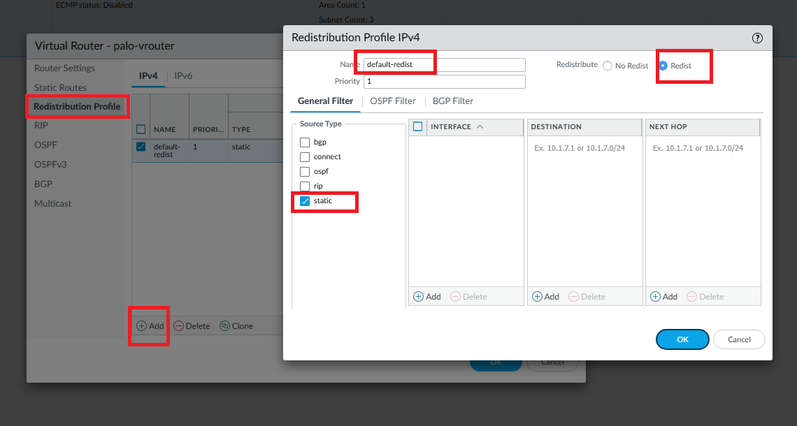

Then go to **OSPF > Export Rules > Add**. I named it `default-redist`, set the type to **Ext-1** (External Type 1) so this path is always preferred over Type 2 routes — Type 2 is the usual default — and set the metric to `10`.

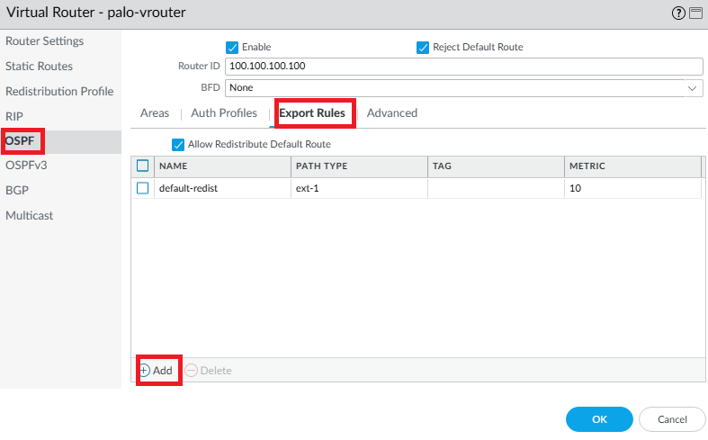

## 6. NAT for Internet Access

Create a NAT policy so internal networks can reach the internet.

Go to **Policies > NAT > Add**, name it, add a description, and leave the rest of the **General** tab as default.

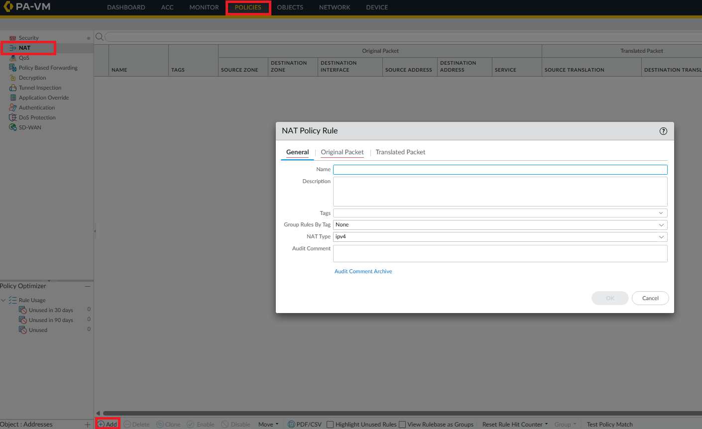

**Original Packet:**

| Field | Value |
|---|---|
| Source Zone | `Inside` |
| Destination Zone | `Outside` |
| Destination Interface | `e1/1` |
| Service | `any` |

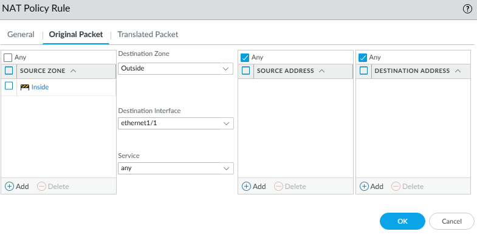

**Translated Packet:**

| Field | Value |
|---|---|
| Translation Type | Dynamic IP and Port |
| Address Type | Interface Address |
| Interface | `e1/1` |
| IP Address | `Outside-198.18.1.2` |

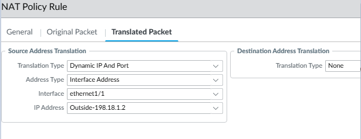

### Second rule — DMZ network

Repeat the same pattern for the DMZ zone.

**Original Packet:**

| Field | Value |
|---|---|
| Source Zone | `dmz-zone` |
| Destination Zone | `Outside` |
| Destination Interface | `e1/1` |
| Service | `any` |

**Translated Packet:**

| Field | Value |
|---|---|
| Translation Type | Dynamic IP and Port |
| Address Type | Interface Address |
| Interface | `e1/1` |
| IP Address | `Outside-198.18.1.2` |
