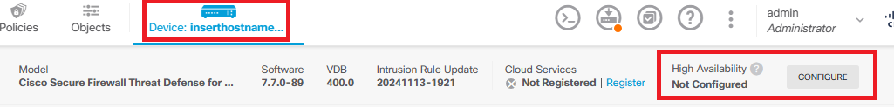
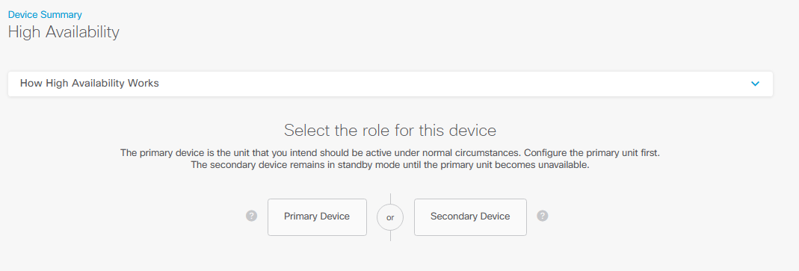
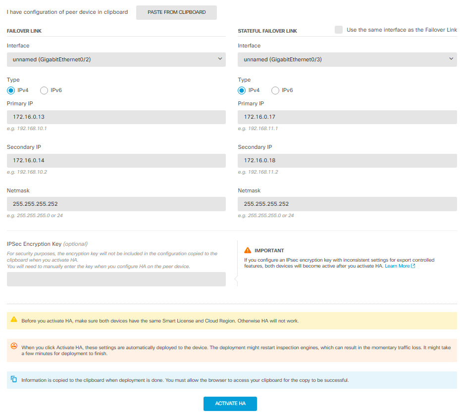
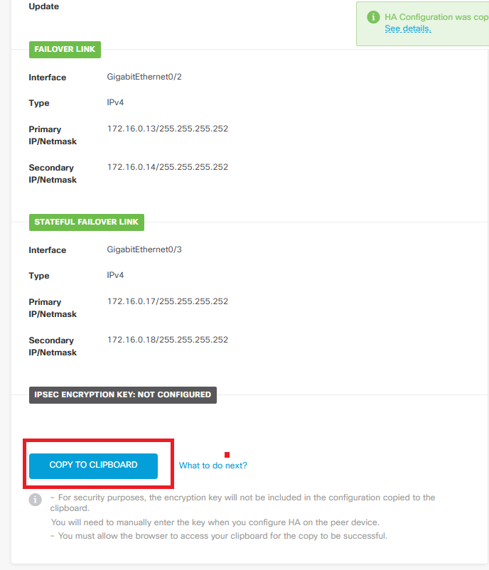
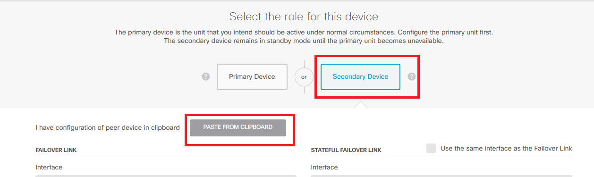
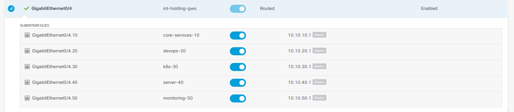

# 03 - FTD HA Config

This lab covers setting up High Availability (active/passive) between two FTD devices.

## Configure the Primary Unit

Go to **Device > High Availability > Configure**.



Select **Primary**, since we're configuring the primary unit of the active/passive pair. (Primary/Secondary is just the role assigned here — which unit is actually Active vs. Standby at any given time can change after a failover.)



Select the interface(s) to use for HA. You can use the same link for both the failover link and the stateful failover link, or dedicate separate interfaces to each — it depends on what you want to do. Set the IPs for the primary (the device currently being configured) and the secondary (the other device). You can also set encryption, and then activate it.



If you get this notice:


Just deploy, and then activate HA.

Scroll down and use the **Copy to Clipboard** option to copy the configuration needed on the other side.



## Configure the Secondary Unit

On the other device, select **Secondary** instead of Primary, and use the **Paste from Clipboard** option.



You'll paste something like this:

```
FAILOVER LINK CONFIGURATION
========================
Interface: GigabitEthernet0/2
Primary IP: 172.16.0.13/255.255.255.252
Secondary IP: 172.16.0.14/255.255.255.252

STATEFUL FAILOVER LINK CONFIGURATION
========================
Interface: GigabitEthernet0/3
Primary IP: 172.16.0.17/255.255.255.252
Secondary IP: 172.16.0.18/255.255.255.252
```

> **Note:** In this example, separate interfaces were used for each role — GigabitEthernet0/2 for the failover link and GigabitEthernet0/3 for the stateful failover link.

Remember to input your IPsec encryption key if you had one set.

Activate it. After a while it will show **Active/Standby**, indicating the HA peering completed successfully.


## Notes on HA Monitoring

Keep in mind I did not set a standby IP address to probe reachability, so failover only triggers when the interface itself shows fully down. Because of this, I did not enable HA monitoring for my subinterfaces.


