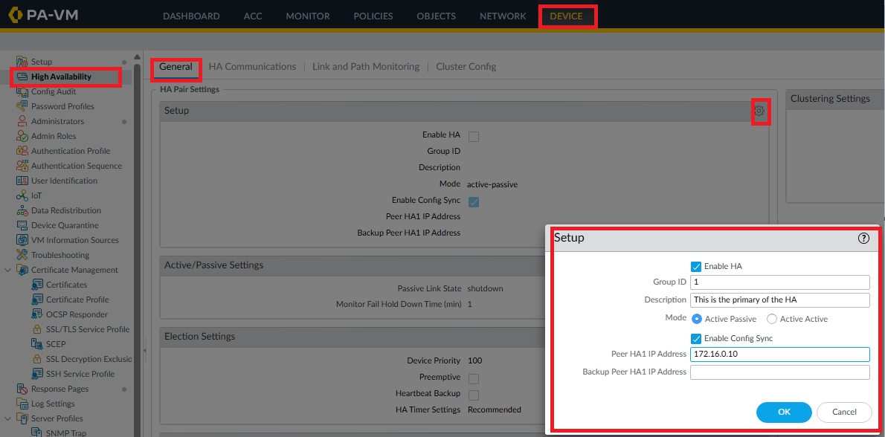
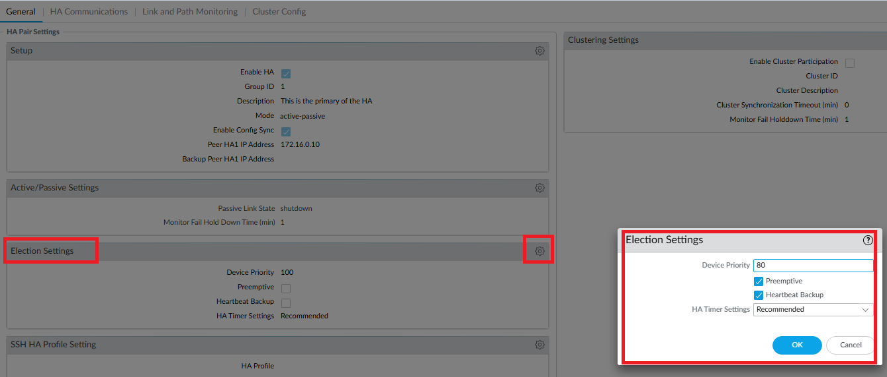
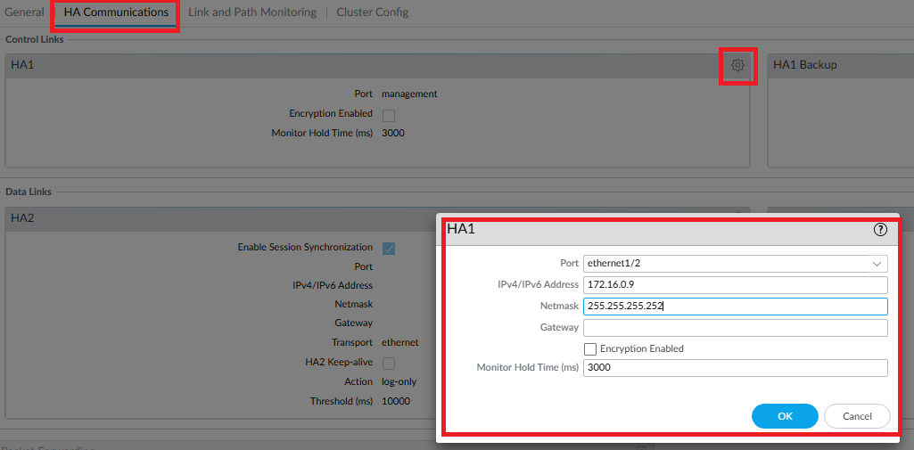
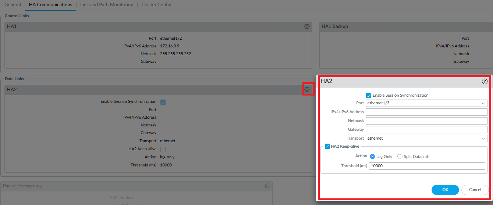
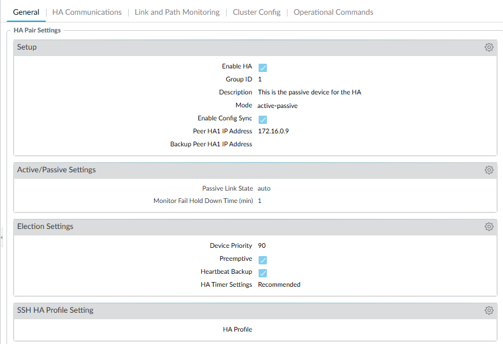
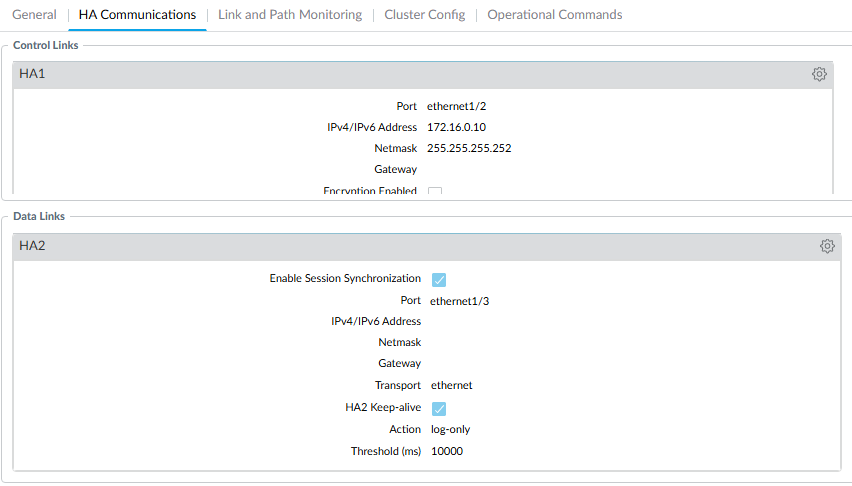
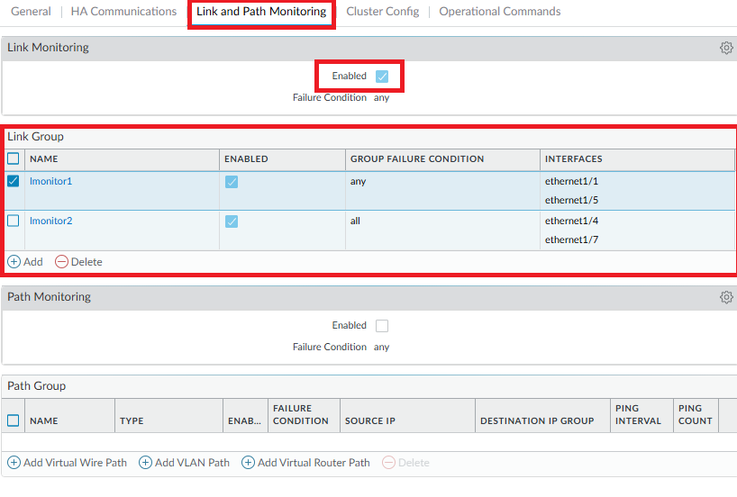

# Palo Alto High Availability (Active/Passive) & Link Monitoring

## Lab Overview

This lab covers a basic Active/Passive HA setup between the two Palo Alto firewalls, plus link monitoring on the interfaces that matter for failover.

> You need to have already configured the interfaces you'll use for HA before starting this lab. If you haven't done that yet, go through the [network config lab](../02-palo-alto-network-config) first — that's where you are shown how to set interface types

## 1. Enable HA

Go to **Device > High Availability > General > Setup > (gear icon)**.

Enable HA, set **Group ID** to `1`, add a description, and set the mode to Active/Passive. For **Peer HA1 IP Address**, enter the IP belonging to the *other* firewall — not this one.

## 2. Election Settings

Go to the **Election Settings** gear icon.

Set **Device Priority** lower on the firewall you want to act as primary — the default is `100`, so I set this one to `80` (lower priority number wins the election and becomes active).

Check **Preemptive** and **Heartbeat Backup**.

> **Preemptive** lets the higher-priority firewall reclaim the active role automatically once it recovers from a failure, instead of leaving the current active firewall in place indefinitely. **Heartbeat Backup** sends redundant heartbeat/hello messages over the management port, so a real failure can still be detected even if the HA1 control link itself goes down — without it, a downed HA1 link alone could cause both firewalls to believe the other is dead and both try to go active at once (a split-brain condition).

## 3. HA Communications — Control Link (HA1)

Go to **HA Communications > Control Link (HA1) > (gear icon)**.

Set the local interface and IP address you'll use for the control link.

## 4. HA Communications — Data Link (HA2)

Go to **Data Links > HA2 > (gear icon)** and select the port you'll use.

I enabled **HA2 Keep-alive** so I'm notified if the data link goes down, rather than silently losing session synchronization between the peers.

> Quick clarification on what HA1 vs. HA2 actually carry, since it's easy to conflate them: **HA1** is the control link — it carries heartbeats, hello messages, HA state, and configuration sync between the peers. **HA2** is the data link — it carries session tables, forwarding tables, IPSec SAs, and ARP tables, i.e. the live state that lets the passive firewall take over without dropping existing sessions. So HA2 Keep-alive protects *session* synchronization specifically, not the configuration sync (that's HA1's job).

That's all that's needed for a basic HA setup.

## 5. Mirror the Configuration on the Peer

The other firewall mirrors this configuration. The one difference: on this peer, I set the priority lower than the default, but still higher than the active firewall's priority — so it stays eligible to take over, without contending to be active initially.

## 6. Link and Path Monitoring

Link and Path Monitoring are both enabled and set to a default failure condition of **Any** out of the box.

I created two link groups:

- **Link Monitor 1** — contains the link to my `outside` zone and the link to my `dmz` zone. Since each of these only has a single physical link with no redundancy, the failure condition is set to **Any**: if either one goes down, I need failover to happen.
- **Link Monitor 2** — contains my two transit links to the FTD. These already have their own redundancy via OSPF rerouting, so the failure condition is set to **All**: failover should only trigger if *both* links go down.

I disabled Path Monitoring since I'm not using it in this lab.

