# Initial Palo Alto Firewall Configuration

This lab covers the initial setup of a Palo Alto firewall (PA-VM), including base networking, admin hardening, syslog forwarding, and a configuration backup.

> Refer back to the docs folder [docs](../../docs/) fp the network diagram and network architecture `.md` as needed or for IP/interface context.

---

## 1. Initial IP Configuration (CLI)

Log into the console. Default Palo Alto credentials are usually `admin` / `admin`.

```
admin@PA-VM> configure
Entering configuration mode
[edit]
admin@PA-VM# set deviceconfig system hostname pa-vm
admin@PA-VM# set deviceconfig system type static
admin@PA-VM# set deviceconfig system ip-address 192.168.10.4 netmask 255.255.255.240
admin@PA-VM# set deviceconfig system dns-setting servers primary 198.18.128.1
admin@PA-VM# commit
```

```
Commit job 7 is in progress. Use Ctrl+C to return to command prompt
...........98%..............100%
Configuration committed successfully
```

## 2. Accessing the GUI

Once the initial IP setup is done, go to `https://<yourIP>`.

If you get a certificate error, click **Advanced > Continue**. This happens because the certificate is only locally recognized by the firewall — it'll keep happening until you provide a domain-recognized certificate or manually trust it.

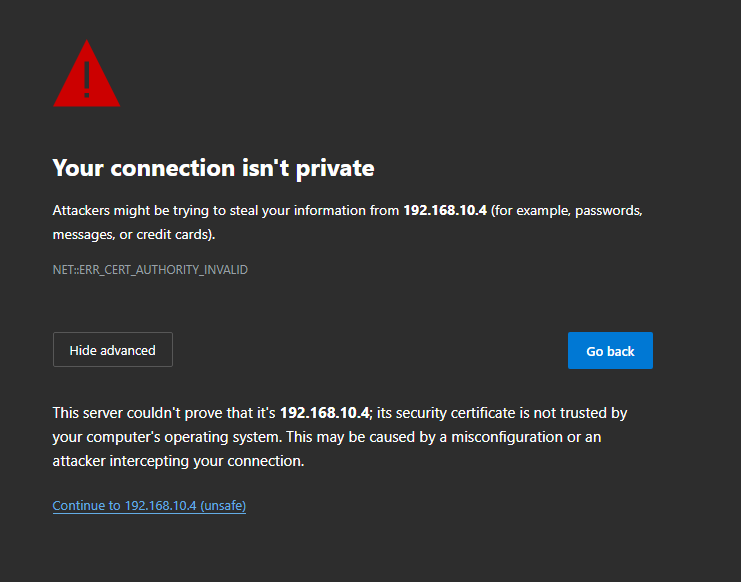

Log in using `admin` plus the new password.

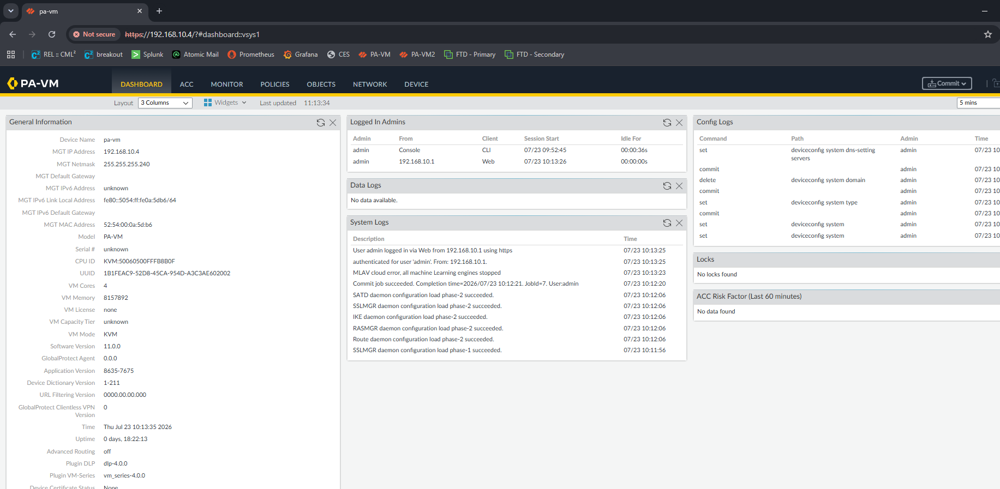

**Troubleshooting tip:** if you think you've configured the management IP but it's not taking, run:

```
show interface management
```

90% of the time, the issue for me has been forgetting to set the type to `static` — the interface was still set to DHCP, and since there was no DHCP server available in this environment, it just wasn't getting an IP at all.

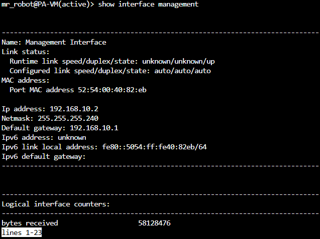

## 3. Session Timeout & Admin User Hardening

Part of hardening the box: set the max number of admin accounts, the amount of time before they get logged out (this is overall session time, not idle time), and create a new admin user instead of relying on the default one.

Go to **Device > Setup > Management > Authentication Settings > (gear icon)**.

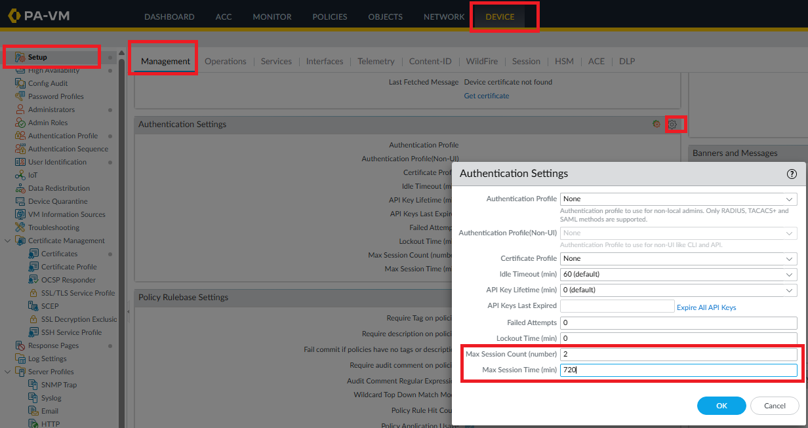

Then, on the left panel, select **Administrators > Add**, and fill in the information.

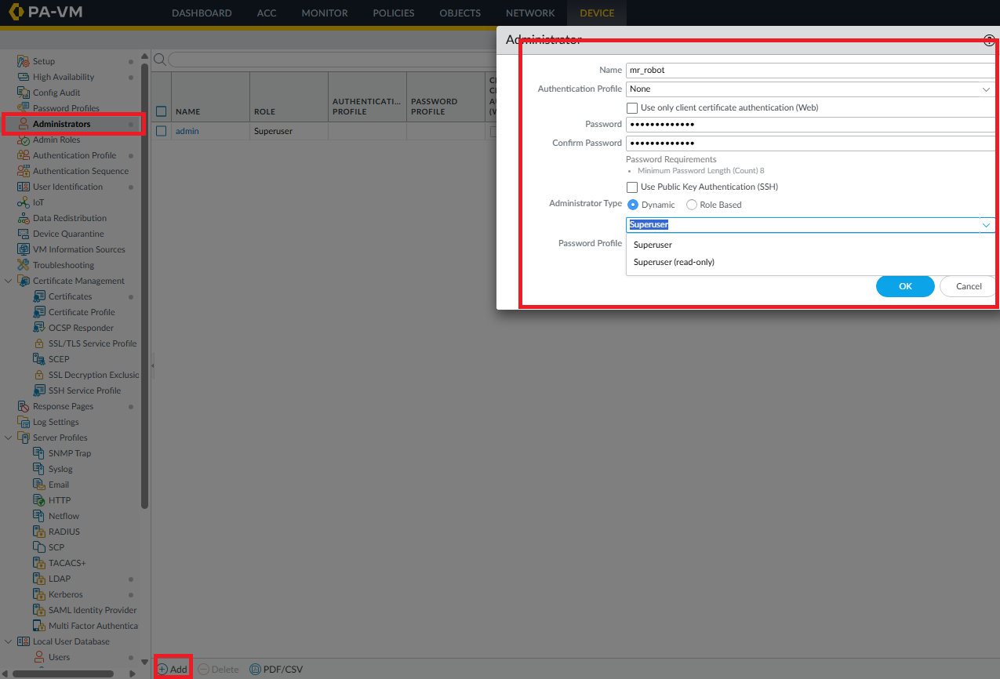

Commit the changes.

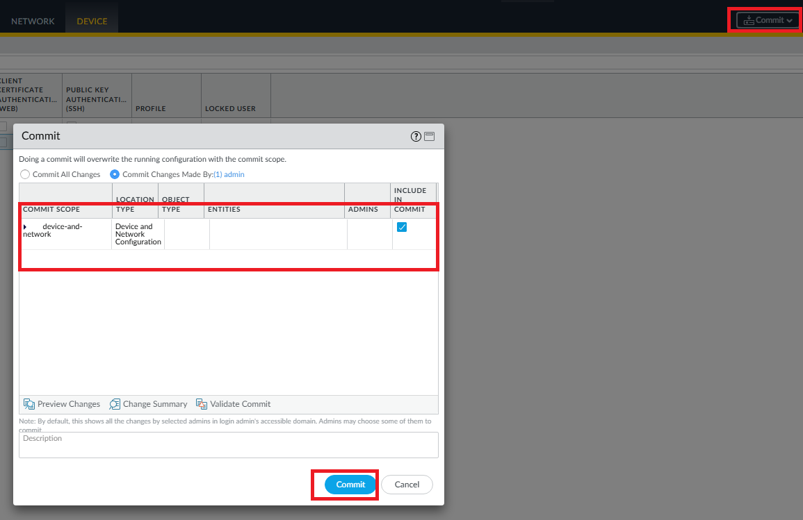

Always check the commit details and notices — this tells you whether something went wrong.

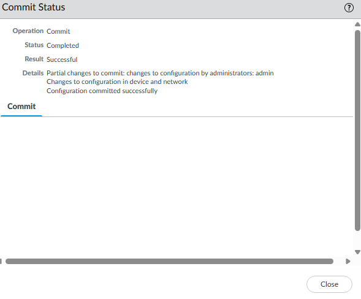

## 4. DNS & NTP

Back in **Setup > Services > (gear icon)**, you can see the DNS settings. I had already set the IP provided by the dCloud platform as primary DNS, and added Google DNS as a secondary.

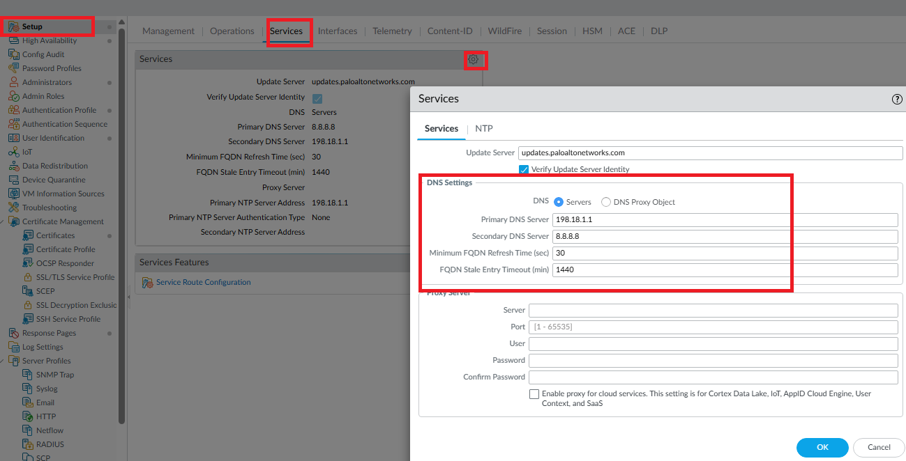

Then go to **NTP** and set your NTP server — here I used the IP provided by the dCloud platform.

> If you're not on a lab platform that provides one, you can point this at a public NTP pool close to your location instead (e.g. `pool.ntp.org` has regional subdomains like `north-america.pool.ntp.org` or `europe.pool.ntp.org`). Accurate time matters more than it seems for a firewall — it affects log timestamp accuracy, certificate validation, and correlating events with other devices like your syslog server.

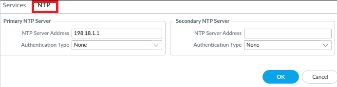

## 5. Syslog Server & Log Forwarding

### Add the syslog server profile

Go to **Server Profiles > Syslog > Add**, and enter the server information. In this case it's listening on my Splunk server.

- Transport: **TCP** — prioritizing reliable log delivery over raw speed
- Format: **IETF** (since using TCP transport)
- Facility: **LOG_LOCAL0**

### Set up log forwarding

Go to **Objects > Log Forwarding > Add**.

I named the profile `default` so it automatically populates the log forwarding field on new rules. For rules that already exist, you'll need to manually set it.

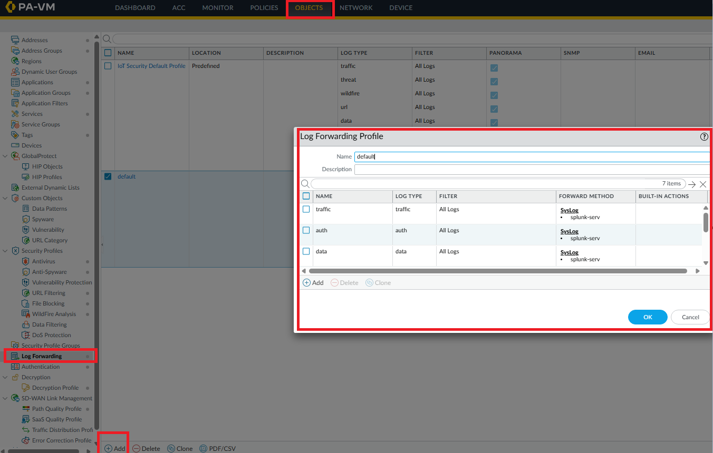

I added all the log types.

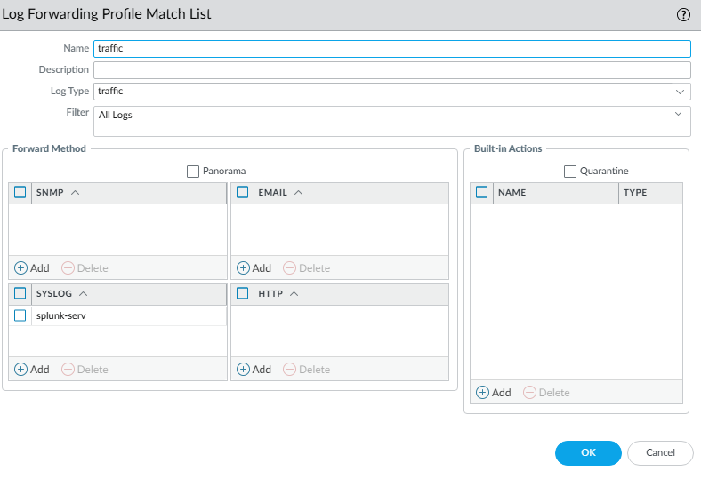

> **Note:** All my rules log at session start *and* end, since I want full visibility for troubleshooting and to have more log data to work with in this lab. In a real environment, it's better to be deliberate about where you actually need start, end, or both — logging everything has a cost.

### Point system logs to the syslog profile

Now that policy-based logs are set, go to **Device > Log Settings** and point all log types to your syslog server profile.

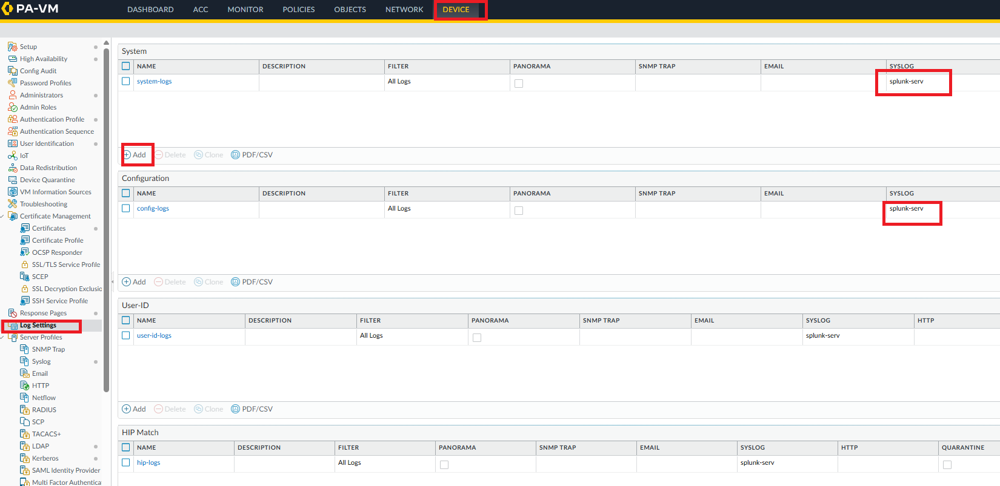

> A security policy rule will need to be created so the firewall can actually reach the syslog server — that'll be covered in the policy creation lab.

Remember to commit your config changes.

> **Note on committing:** Committing fairly often is fine for testing as you go, but in production environments it's best to batch related changes into a single commit rather than committing after every small edit. This reduces how often you touch the data plane, keeps the Config log history easier to audit (one meaningful commit per change set vs. many small ones), and lowers the risk of committing an incomplete or untested change. Always use **Preview Changes** and add a commit comment describing what changed and why.

## 6. Configuration Backup

At this point, with the main services up and running, it's a good time to take a backup.

Go to **Setup > Operations > Export Named Configuration Snapshot**.

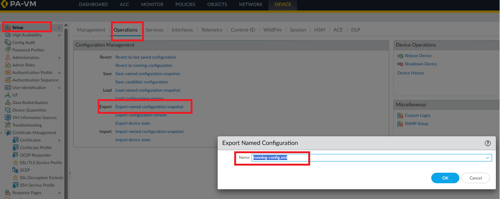

> You can also set up scheduled backups using Panorama. Since I don't have a Panorama VM in this lab, I'll handle scheduled backups with a script in a separate lab.

## 7. Password Policy

Go to **Device > Setup > Management**, scroll down to **Minimum Password Complexity**, and click the gear icon.

I set mine to:
- Minimum length: 8
- Requires 1 uppercase letter
- Requires 1 lowercase letter
- Requires 1 numeric value
- Requires 1 special character

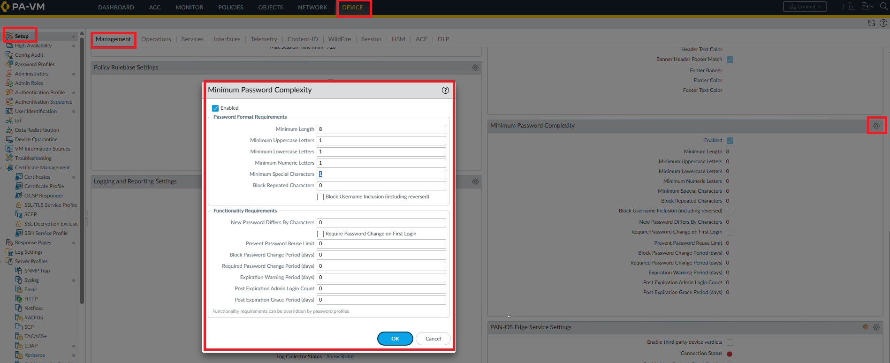

## 8. Login Banner

Not configured on my instance yet — feel free to look into where and how to set this up if you want it for your own build.

---

## References

- [Configure Management IP](https://knowledgebase.paloaltonetworks.com/KCSArticleDetail?id=kA10g000000ClN7CAK)
- [Configure a Firewall Administrator Account](https://docs.paloaltonetworks.com/ngfw/administration/firewall-administration/manage-firewall-administrators/configure-administrative-accounts-and-authentication/configure-a-firewall-administrator-account)
- [Configure Syslog Monitoring](https://docs.paloaltonetworks.com/ngfw/administration/monitoring/use-syslog-for-monitoring/configure-syslog-monitoring)
- [Save and Export Firewall Configurations](https://docs.paloaltonetworks.com/ngfw/administration/firewall-administration/manage-configuration-backups/save-and-export-firewall-configurations)
- [Password Profiles](https://docs.paloaltonetworks.com/ngfw/help/11-1/device/device-password-profiles)
